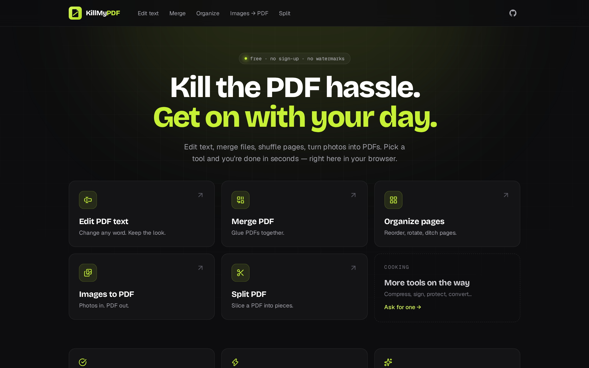
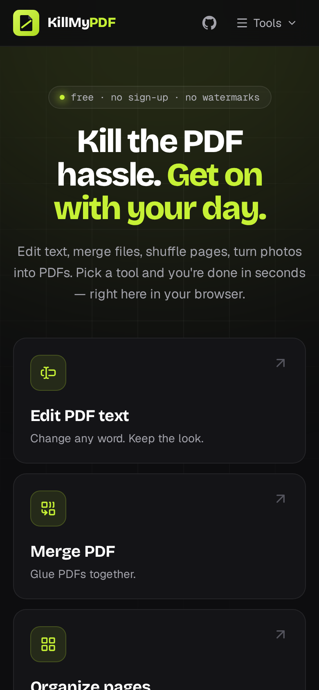
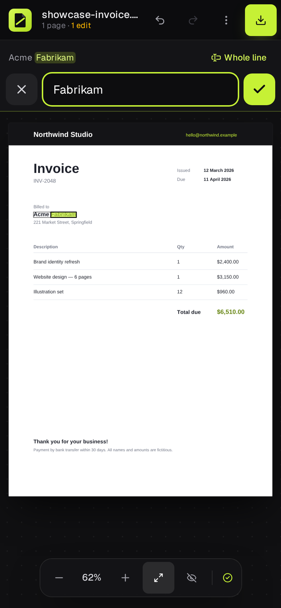
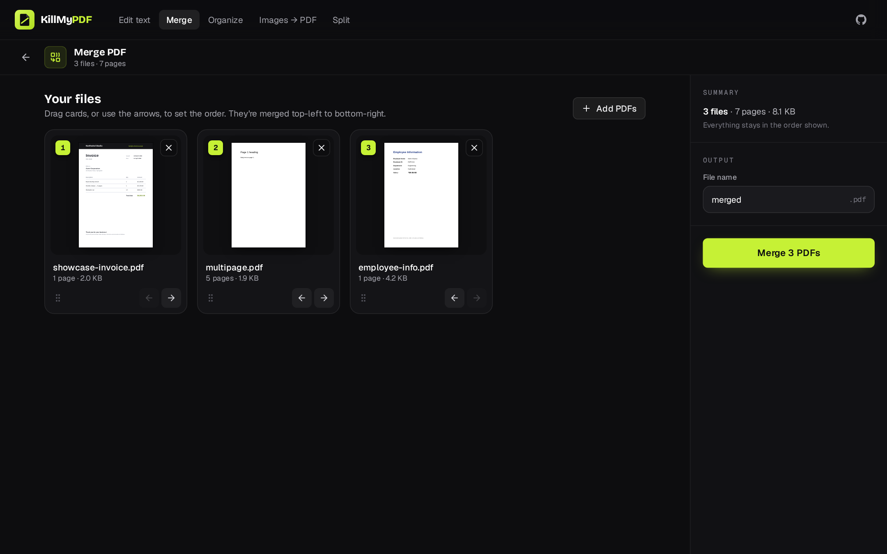
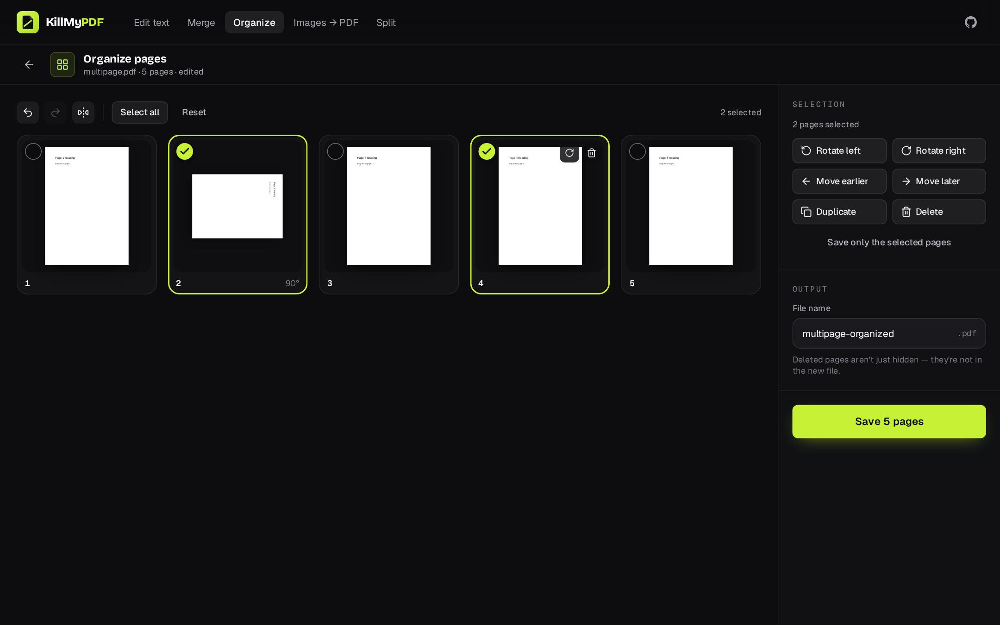
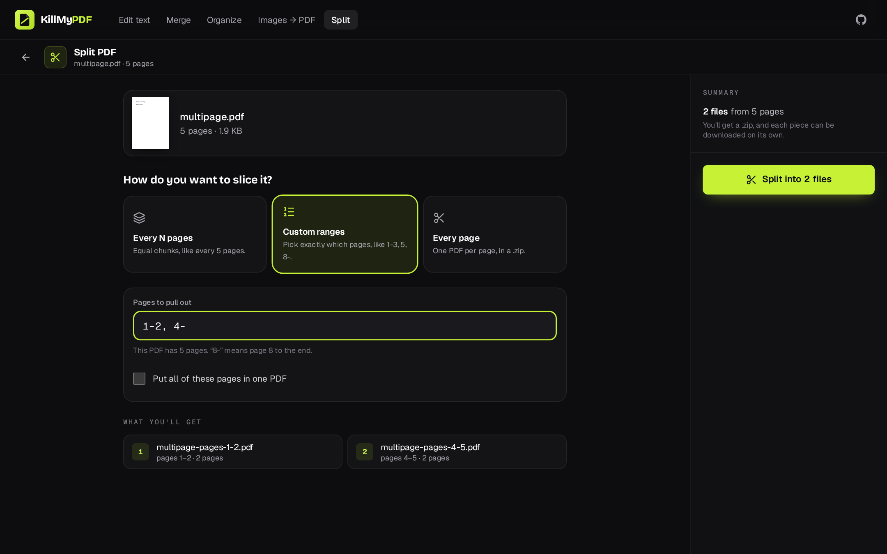
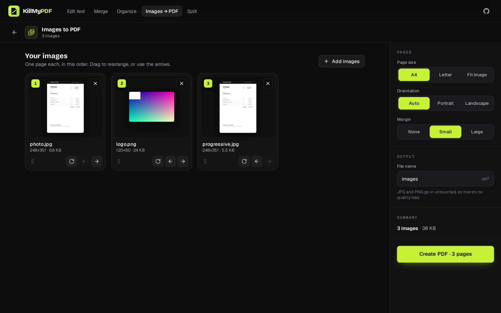
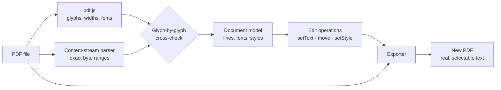

<div align="center">


# KillMyPDF

**Kill the PDF hassle.**

Edit text, merge files, shuffle pages, split documents and turn photos into PDFs. Free, instant, and it all runs in your browser: no sign-up, no watermarks.

[](https://nextjs.org)
[](https://www.typescriptlang.org)
[](https://mozilla.github.io/pdf.js/)
[](https://tailwindcss.com)
[](#-deploy-to-netlify)
[](#-contributing)

[Tools](#-the-tools) · [Why it's different](#-why-its-different) · [Mobile](#-built-for-phones-too) · [Quick start](#-quick-start) · [How it works](#-how-it-works) · [Roadmap](#-roadmap)

<br/>



</div>

<br/>

## 🧰 The tools

| Tool | What it does |
|---|---|
| **Edit PDF text** | Click a line, type your change, download. Keeps the original fonts, sizes, colours and positions, and the text stays real, selectable and searchable. |
| **Merge PDF** | Glue any number of PDFs together. Drag cards (or use the arrows) to set the order. |
| **Organize pages** | See every page as a thumbnail. Drag to reorder, rotate, duplicate or delete, with undo and redo. Deleted pages are really gone from the file. |
| **Images to PDF** | Photos, scans and screenshots → one PDF. A4, Letter or fit-to-image pages; JPG and PNG go in untouched, with no quality loss. |
| **Split PDF** | Every N pages, custom ranges like `1-3, 5, 8-`, or one file per page. Download the pieces on their own or as a `.zip`. |

Finish one tool and keep going: the **result screen hands your PDF straight to the next tool** (merge → organize → edit) without re-uploading.

## ✨ Why it's different

Most "free online PDF editors" don't edit your text at all. They paint a **white box over the old words** and stamp new text on top. The original is still in the file: copy, search or a screen reader will find it, and the new text rarely matches the font.

KillMyPDF changes the PDF itself.

| | Typical online editor | **KillMyPDF** |
|---|:---:|:---:|
| Old text actually removed from the file | ❌ hidden under a box | ✅ |
| Keeps the document's own font, size and colour | ⚠️ approximated | ✅ reuses the original font |
| Result is real, selectable, searchable text | ⚠️ often flattened | ✅ |
| Rest of the page left untouched | ❌ | ✅ verified by pixel tests |
| Deleted pages really deleted | ⚠️ often just hidden | ✅ verified by tests |
| Account, upload or watermark | usually | **none** |

<div align="center">

</div>

## 🔎 Word-level editing

A PDF stores text as lines, but you want to change a *word*. Double-click (or tap twice on a phone) and **only the word you pointed at is selected**: type to replace it and leave the rest of the line alone.

This works on PDFs saved from Chrome ("Print to PDF") too, where each letter is drawn separately and there are no space characters: lines are read back as proper lines, edits stay in the document's own font, and if one word needs a letter the font doesn't contain, only that word changes font.

## 📱 Built for phones too

The touch experience was designed on its own rather than squeezed down from desktop:

- **Tap to select, tap again to edit.** The first tap marks the word under your finger; the second opens an edit bar with that word already selected.
- **Scrolling never selects.** Selection happens when your finger lifts, so dragging over text just scrolls.
- **Forgiving taps.** Small text still gets hit if your finger lands a little beside it.
- **Pinch to zoom**, with the spot under your fingers staying put.
- **A docked edit bar**, not a tiny field on the page, so the on-screen keyboard never covers what you're typing and iOS never zooms in.
- **44 px touch targets** on touch devices, a bottom action bar on the page tools, and arrow buttons everywhere you can drag (because dragging is fiddly on a phone).

<div align="center">
<table>
  <tr>
    <td width="33%"></td>
    <td width="33%"></td>
    <td width="33%"></td>
  </tr>
</table>
</div>

## 🖼️ Screenshots

<table>
  <tr>
    <td width="50%"></td>
    <td width="50%"></td>
  </tr>
  <tr>
    <td></td>
    <td></td>
  </tr>
</table>

## ⚡ Quick start

Requires **Node.js 20.9+**.

```bash
git clone https://github.com/mohitphoenix24/Kill-My-PDF.git
cd Kill-My-PDF
npm install
npm run dev
```

Open <http://localhost:3000>. To try the editor straight away, use [`tests/fixtures/showcase-invoice.pdf`](tests/fixtures/showcase-invoice.pdf).

| Command | What it does |
|---|---|
| `npm run dev` | Start the dev server (copies pdf.js assets into `public/` first) |
| `npm run build` | Static production build into `out/` |
| `npm test` | Unit, analysis and export round-trip tests (Vitest) |
| `npm run test:e2e` | Browser tests against the production build: desktop, touch phone, and every tool |
| `npm run lint` / `npm run typecheck` | ESLint and strict TypeScript |
| `npm run capture` | Regenerates README screenshots and social images from the real app |

## 🧠 How it works

Every tool runs in your browser, on your own device, using [pdf.js](https://mozilla.github.io/pdf.js/) to read and render and [pdf-lib](https://pdf-lib.js.org/) to write.

The page tools copy and rearrange the PDF's own pages, fonts and images; nothing is re-drawn or flattened. The **text editor** goes further:



1. **Analyse.** The content streams are parsed with a purpose-built tokenizer that remembers the exact bytes behind every piece of text. pdf.js supplies glyph widths and unicode. The two are cross-checked character by character, so the editor never touches bytes it hasn't positively identified.
2. **Edit.** Every change is a small, serialisable operation (`setText`, `move`, `setStyle`, `reset`). Undo and redo are a cursor over that list, and the original file is never modified.
3. **Export.** For each edit the exporter picks the most faithful strategy: **rewrite in place** in the original font; **redraw** (remove the old glyphs without shifting their neighbours, then draw again in the original or a matching font); or **remove**. The old text is deleted from the file, and the result is verified by re-opening it.

Full details, including design decisions, the touch-interaction design, the design system and known limitations, are in [**docs/ARCHITECTURE.md**](docs/ARCHITECTURE.md).

## 🧪 Quality

- **85 unit and integration tests**: geometry checked against pdf.js for every page rotation, the content parser, font analysis, export round-trips, and the page tools (including proof that deleted pages are gone from every stream of the output file).
- **Pixel-diff tests**: after a text edit, zero pixels may change outside the edited text.
- **Independent verification**: exported files are re-read by both pdf.js and Poppler's `pdftotext`.
- **Browser tests** against the production build, in three suites:
  - **Desktop editor.** Word-level editing, undo/redo, download and verification, errors.
  - **Touch phone.** Scrolling doesn't select, taps are forgiving, a tapped word is the word that gets edited, pinch zoom, a bottom sheet instead of a side panel, no horizontal overflow.
  - **Every tool.** Drag-reordering, zip contents, EXIF-rotated photos landing on the right page, the merge → organize handoff, plus SEO output on every page.
- **Measured performance**: a 300-page, 15,000-line PDF opens in ~170 ms, and a text edit exports in ~110 ms.

## 🗺️ Roadmap

- [x] Edit text in digital PDFs, keeping the original fonts
- [x] Word-level editing, move, resize and recolour text
- [x] **Merge PDFs**
- [x] **Organize pages**: reorder, rotate, duplicate, delete
- [x] **Images to PDF**
- [x] **Split PDF**
- [x] Designed for touch: tap, pinch, docked edit bar
- [ ] Compress PDF
- [ ] Add new text boxes, images and signatures
- [ ] Protect / unlock with a password
- [ ] Convert PDF → images
- [ ] Offline support (PWA)

Got a tool you wish existed? [Open an issue](https://github.com/mohitphoenix24/Kill-My-PDF/issues).

## 🧱 Tech stack

| | |
|---|---|
| **App** | Next.js 16 (static export), React 19, TypeScript (strict) |
| **UI** | Tailwind CSS 4, [dnd-kit](https://dndkit.com/) for drag-to-reorder, Lucide icons, Bricolage Grotesque + Geist |
| **PDF reading & rendering** | [pdf.js](https://github.com/mozilla/pdf.js) |
| **PDF writing** | [pdf-lib](https://github.com/Hopding/pdf-lib) + fontkit, plus a custom content-stream parser and interpreter |
| **ZIP** | [fflate](https://github.com/101arrowz/fflate) |
| **Testing** | Vitest, Playwright, Poppler |
| **Hosting** | Any static host; configured for Netlify |

<details>
<summary><b>Project structure</b></summary>

```text
src/
├─ app/                    # Routes (one tiny page per tool), layout, SEO: robots, sitemap, manifest
├─ config/
│  ├─ site.ts              # Product name, SEO text, URLs
│  └─ tools.ts             # The tool registry: names, copy, FAQ — drives nav, pages, sitemap
├─ components/
│  ├─ home/                # The tool picker
│  ├─ shell/               # Site header and footer
│  ├─ tools/               # Start pages + one work screen per tool (merge/, organize/, split/, images/, edit/)
│  ├─ editor/              # The text editor: workspace, top bar, inspector, mobile edit bar
│  ├─ viewer/              # Page canvas, text layer, hit-testing overlay, inline editor, toolbar
│  └─ ui/                  # Buttons, dialogs, toasts, logo
└─ lib/
   ├─ geometry/            # Matrices and PDF ⇄ screen coordinates
   ├─ model/               # Document model types
   ├─ editor/              # Edit operations and undo history
   ├─ text/                # Word targeting
   └─ pdf/                 # Text editor engine (parser, analysis, fonts, export) and tools/ (merge, organize, split, images)
tests/                     # Vitest suites, fixtures, Playwright browser tests
docs/                      # Architecture notes, screenshots, social preview
```

</details>

## 🚢 Deploy to Netlify

The app is a fully static site. There are no servers, functions or databases.

[](https://app.netlify.com/start/deploy?repository=https://github.com/mohitphoenix24/Kill-My-PDF)

Or manually: in Netlify choose **Add new site → Import an existing project** and pick your fork. The settings are read from [`netlify.toml`](netlify.toml): build command `npm run build`, publish directory `out`, Node 22.

Canonical URLs, the sitemap and the social preview images automatically use your Netlify URL. For a custom domain, set `NEXT_PUBLIC_SITE_URL` (for example `https://killmypdf.com`) in Netlify's environment variables.

## ⚠️ Limitations

- **Text editing is for digital PDFs only.** Scanned documents are images of text and would need OCR; they are detected and reported.
- **Substitute fonts.** When an embedded font subset lacks a character you type, a similar font is used for the word that needs it (the rest of the line keeps its font), and the app tells you which.
- **Read-only text.** Text inside reusable form objects, vertical text and invisible OCR layers are shown read-only.
- **Merging and organizing don't carry over** bookmarks or fillable form fields. Pages, text, images and fonts come across intact.
- **Password-protected PDFs aren't supported.** Encrypted PDFs that open without a password can be viewed but not edited.
- **Digital signatures.** Changing a signed PDF invalidates its signature, as with any editor.

See [docs/ARCHITECTURE.md](docs/ARCHITECTURE.md#known-limitations) for the complete list.

## 🤝 Contributing

Issues and pull requests are welcome. Before opening a PR:

```bash
npm run lint && npm run typecheck && npm test
npm run build && npm run test:e2e   # needs: npx playwright-core install chromium
```

**Adding a tool** takes a registry entry plus one work component; the steps are in [docs/ARCHITECTURE.md](docs/ARCHITECTURE.md#site-structure). New PDF edge cases are best added as a small generated fixture in [`scripts/generate-fixtures.mjs`](scripts/generate-fixtures.mjs) with a test.

## 🙏 Acknowledgements

- [pdf.js](https://github.com/mozilla/pdf.js) by Mozilla, for parsing and rendering
- [pdf-lib](https://github.com/Hopding/pdf-lib), for writing PDFs
- [dnd-kit](https://dndkit.com/), [fflate](https://github.com/101arrowz/fflate) and [Lucide](https://lucide.dev/)
- [DejaVu fonts](https://dejavu-fonts.github.io/), the bundled fallback fonts (Bitstream Vera licence, see [`public/fonts/dejavu/LICENSE.txt`](public/fonts/dejavu/LICENSE.txt))

<div align="center">
<br/>

**If KillMyPDF saved you a PDF subscription, a ⭐ helps others find it.**

</div>
