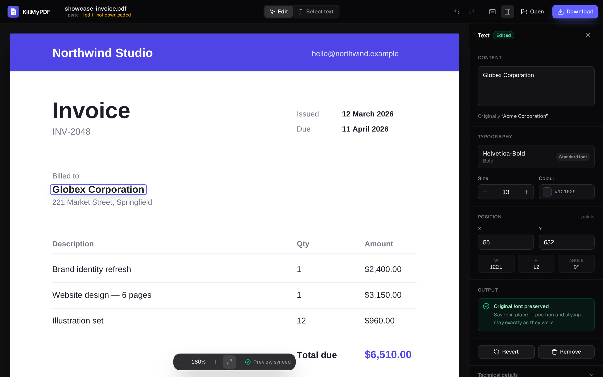
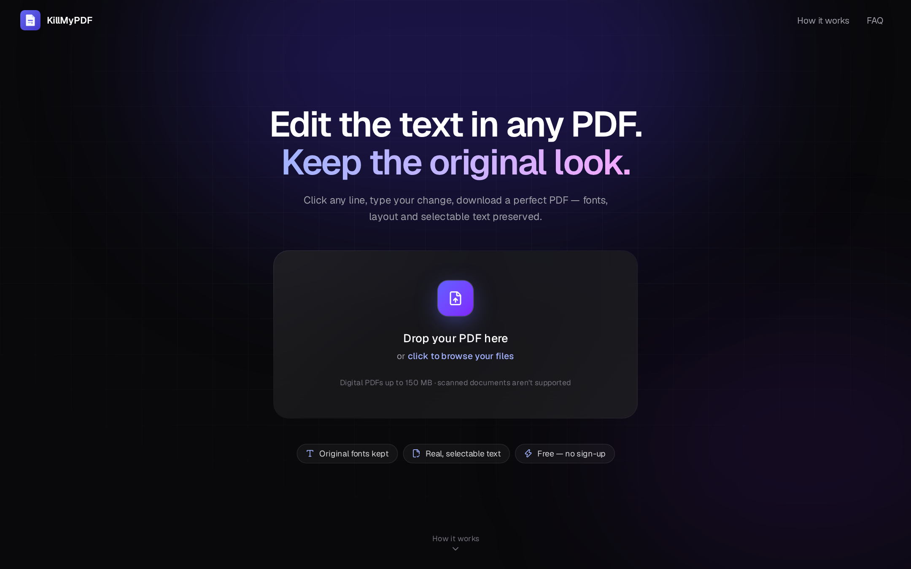
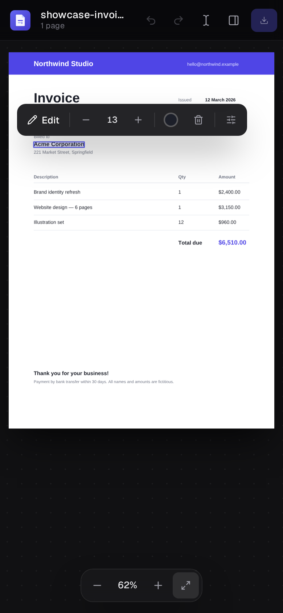
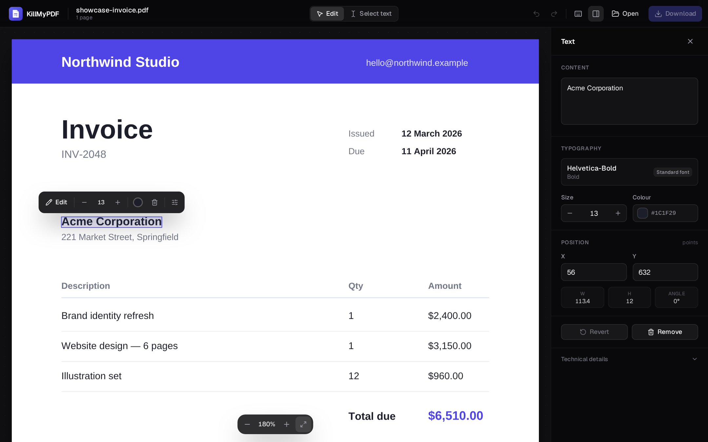
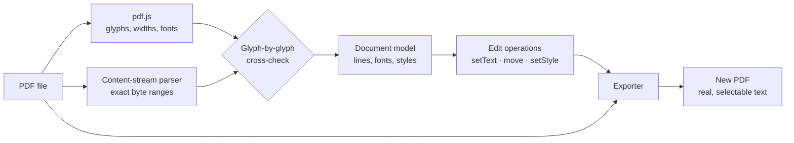

<div align="center">


# KillMyPDF

**Edit the text in any PDF — and keep the original look.**

Click a line, type your change, download a real PDF. Same fonts, same layout, and every word still selectable and searchable.<br/>
Free, no sign-up, and it all runs in your browser.

[](https://nextjs.org)
[](https://www.typescriptlang.org)
[](https://mozilla.github.io/pdf.js/)
[](https://tailwindcss.com)
[](#-deploy-to-netlify)
[](#-contributing)

[Features](#-features) · [Why it's different](#-why-its-different) · [Quick start](#-quick-start) · [How it works](#-how-it-works) · [Roadmap](#-roadmap)

<br/>



</div>

<br/>

## ✨ Why it's different

Most "free online PDF editors" don't edit your text at all. They paint a **white box over the old words** and stamp new text on top. The original is still in the file: copy, search or a screen reader will find it, and the new text rarely matches the font.

This editor changes the PDF itself.

| | Typical online editor | **KillMyPDF** |
|---|:---:|:---:|
| Old text actually removed from the file | ❌ hidden under a box | ✅ |
| Keeps the document's own font, size and colour | ⚠️ approximated | ✅ reuses the original font |
| Result is real, selectable, searchable text | ⚠️ often flattened | ✅ |
| Rest of the page left byte-for-byte untouched | ❌ | ✅ verified by pixel tests |
| Upload, account or watermark | usually | **none** — runs in your browser |

## 🚀 Features

- **Click-to-edit text.** Every line of a digital PDF is detected with its font, size, weight, colour, position and rotation. Double-click to type directly on the page.
- **Original fonts, preserved.** When the original font can draw your new text, the change is written *in place*, so position, spacing and styling stay exactly as they were. If an embedded font subset is missing a character, a matching font (serif, sans or mono, same weight) is used, and the app tells you so.
- **Move, resize, recolour.** Drag text, nudge it with the arrow keys, change its size or colour from the floating toolbar.
- **Live, honest preview.** The page you see is the exported PDF, re-rendered after every edit. What you see is what you download.
- **Undo / redo** for every change, plus a change list with one-click revert.
- **Works with real-world PDFs.** Handles kerning (`TJ`), rotated text and rotated pages, crop boxes, character and word spacing, and CMYK colours. Text inside reusable form objects is clearly marked read-only rather than broken.
- **Safe by design.** Scanned, password-protected, encrypted and corrupted files are detected with clear messages. The uploaded file is never modified, and every export starts again from the original.
- **Mobile friendly.** Tap to select, edit with the floating toolbar, fine-tune in a bottom sheet.
- **Keyboard shortcuts** for everything (press <kbd>?</kbd>).

## 📸 Screenshots

<table>
  <tr>
    <td width="66%"></td>
    <td width="34%" rowspan="2"></td>
  </tr>
  <tr>
    <td></td>
  </tr>
</table>

## ⚡ Quick start

Requires **Node.js 20.9+**.

```bash
git clone https://github.com/mohitphoenix24/Kill-My-PDF.git
cd Kill-My-PDF
npm install
npm run dev
```

Open <http://localhost:3000> and drop in any digital PDF. To try it straight away, use [`tests/fixtures/showcase-invoice.pdf`](tests/fixtures/showcase-invoice.pdf).

| Command | What it does |
|---|---|
| `npm run dev` | Start the dev server (copies pdf.js assets into `public/` first) |
| `npm run build` | Static production build into `out/` |
| `npm test` | Unit, analysis and export round-trip tests (Vitest) |
| `npm run test:e2e` | Drives the production build in Chromium, desktop and mobile |
| `npm run lint` / `npm run typecheck` | ESLint and strict TypeScript |
| `npm run capture` | Regenerates README screenshots and social images from the real app |

## 🧠 How it works



1. **Analyse.** The PDF's content streams are parsed with a purpose-built tokenizer that remembers the exact bytes behind every piece of text. pdf.js supplies glyph widths and unicode. The two are cross-checked character by character, so the editor never touches bytes it hasn't positively identified.
2. **Edit.** Every change is a small, serialisable operation (`setText`, `move`, `setStyle`, `reset`). Undo and redo are a cursor over that list, and the original file is never modified.
3. **Export.** For each edit the exporter picks the most faithful strategy:
   - **in place:** rewrite the string in the original font;
   - **redraw:** remove the old glyphs without shifting their neighbours, then draw the text again in the original or a matching font;
   - **remove.**

   The old text is deleted from the file, and the result is verified by re-opening it.

Full details, including design decisions and known limitations, are in [**docs/ARCHITECTURE.md**](docs/ARCHITECTURE.md).

## 🧪 Quality

- **51 unit and integration tests:** geometry checked against pdf.js for every page rotation, the content parser, font analysis, and export round-trips.
- **Pixel-diff tests:** after an edit, zero pixels may change outside the edited text.
- **Independent verification:** exported files are re-read by both pdf.js and Poppler's `pdftotext`.
- **End-to-end browser tests** against the production build: editing, undo/redo, download, errors, navigation and mobile.
- **Measured performance:** a 300-page, 15,000-line PDF opens in ~170 ms, and an edit exports in ~110 ms.

## 🗺️ Roadmap

The text editor is the first tool in a growing, privacy-friendly PDF toolkit.

- [x] Edit text in digital PDFs, keeping the original fonts
- [x] Move, resize and recolour text
- [x] Mobile support
- [ ] **Merge PDFs:** combine files in any order
- [ ] **Images to PDF:** turn multiple photos or scans into one PDF
- [ ] **Delete, reorder and rotate pages**
- [ ] Split PDFs and extract pages
- [ ] Add new text boxes and signatures
- [ ] Re-use fonts embedded as full programs for even more edits in the original typeface
- [ ] Offline support (PWA)

Have an idea? [Open an issue](https://github.com/mohitphoenix24/Kill-My-PDF/issues).

## 🧱 Tech stack

| | |
|---|---|
| **App** | Next.js 16 (static export), React 19, TypeScript (strict) |
| **UI** | Tailwind CSS 4, Lucide icons, Geist |
| **PDF reading & rendering** | [pdf.js](https://github.com/mozilla/pdf.js) |
| **PDF writing** | [pdf-lib](https://github.com/Hopding/pdf-lib) + fontkit, plus a custom content-stream parser and interpreter |
| **Testing** | Vitest, Playwright, Poppler |
| **Hosting** | Any static host; configured for Netlify |

<details>
<summary><b>Project structure</b></summary>

```text
src/
├─ app/                    # Next.js app: layout, SEO metadata, robots, sitemap, manifest
├─ components/
│  ├─ App.tsx              # Start screen ⇄ editor workspace
│  ├─ landing/             # Start screen and copy
│  ├─ editor/              # Workspace, top bar, inspector, thumbnails, dock
│  ├─ viewer/              # Page canvas, text layer, overlays, inline editor, toolbar
│  └─ ui/                  # Buttons, dialogs, toasts
├─ config/site.ts          # Product name, SEO text, URLs
└─ lib/
   ├─ geometry/            # Matrices and PDF ⇄ screen coordinates
   ├─ model/               # Document model types
   ├─ editor/              # Edit operations and undo history
   └─ pdf/                 # Parser, analysis, fonts, session, exporter
tests/                     # Vitest suites, fixtures, Playwright E2E
docs/                      # Architecture notes and screenshots
```

</details>

## 🚢 Deploy to Netlify

The app is a fully static site. There are no servers, functions or databases.

[](https://app.netlify.com/start/deploy?repository=https://github.com/mohitphoenix24/Kill-My-PDF)

Or manually: in Netlify choose **Add new site → Import an existing project** and pick your fork. The settings are read from [`netlify.toml`](netlify.toml): build command `npm run build`, publish directory `out`, Node 22.

Canonical URLs, the sitemap and social preview images automatically use your Netlify URL.

## ⚠️ Limitations

- **Digital PDFs only.** Scanned documents are images of text and would need OCR; they are detected and reported.
- **Substitute fonts.** When an embedded font subset lacks a character you type, a similar font is used, and the app tells you which.
- **Read-only text.** Text inside reusable form objects, vertical text and invisible OCR layers are shown read-only.
- **Encrypted files.** Password-protected PDFs aren't supported. Encrypted PDFs that open without a password are view-only.
- **Digital signatures.** Editing a signed PDF invalidates its signature, as with any editor.

See [docs/ARCHITECTURE.md](docs/ARCHITECTURE.md#known-limitations) for the complete list.

## 🤝 Contributing

Issues and pull requests are welcome. Before opening a PR:

```bash
npm run lint && npm run typecheck && npm test
npm run build && npm run test:e2e   # needs: npx playwright-core install chromium
```

New PDF edge cases are best added as a small generated fixture in [`scripts/generate-fixtures.mjs`](scripts/generate-fixtures.mjs) with a round-trip test.

## 🙏 Acknowledgements

- [pdf.js](https://github.com/mozilla/pdf.js) by Mozilla, for parsing and rendering
- [pdf-lib](https://github.com/Hopding/pdf-lib), for writing PDFs
- [DejaVu fonts](https://dejavu-fonts.github.io/), the bundled fallback fonts (Bitstream Vera licence, see [`public/fonts/dejavu/LICENSE.txt`](public/fonts/dejavu/LICENSE.txt))

<div align="center">
<br/>

**If this saved you a PDF subscription, a ⭐ helps others find it.**

</div>
